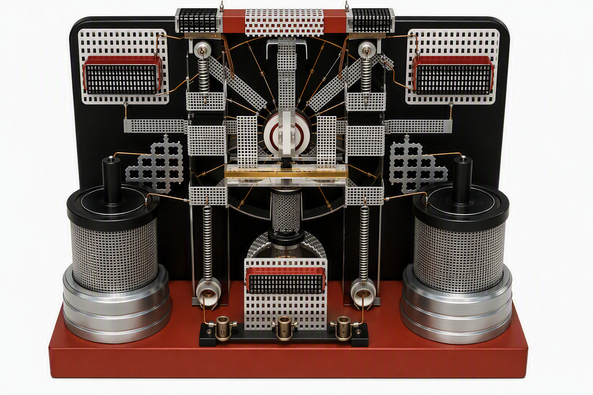

# Testatika Small Research Replica

[](https://github.com/inetconnector/testatika-small-research-replica/actions/workflows/validate.yml)


**Evidence-led, photogrammetric reconstruction of the first small Testatika machine described and tested by Stefan Marinov.**

> This repository is a historical/electrostatic research project. It is **not** presented as a proven free-energy or over-unity device. The original complete electrical circuit is not known, and no net-energy anomaly is claimed here.



## Included

This release targets the **small, single-disc machine shown on the right in Marinov's figures 13/14**. It keeps source-supported geometry, photo-derived dimensions, test hypotheses and unknown wiring explicitly separated.

- nominal **200 mm rotor**
- **20 / 24 / 25** radial copper-wire rotor variants
- through-disc routing points for alternative wire paths
- R0–R4 experimental routing families, including a source-qualified three-side-change R4 research route
- non-contact adjustable sector electrodes
- two side capacitor/"pot" modules: outer grid + dielectric + inner copper spiral
- two horseshoe-magnet mounts for the first small-machine variant
- exchangeable "crystal" carrier
- rear shield-plate experiment jig
- complete STL and STEP part libraries
- complete assembled STEP / STL / OBJ / GLB model
- evidence matrix, photogrammetry, BOM, assembly and experiment documentation
- consolidated research knowledge base in [`STATE.md`](STATE.md)
- external/session handoff in [`addon.md`](addon.md)
- detailed **Baumann / Methernitha language decoder** mapping historical terminology to testable engineering hypotheses

## Quick access

| Asset | Path |
|---|---|
| Complete STEP | `hardware/complete-model/Testatika_Small_Marinov_FirstMachine_V2_COMPLETE.step` |
| Complete STL | `hardware/complete-model/Testatika_Small_Marinov_FirstMachine_V2_COMPLETE.stl` |
| Complete GLB | `hardware/complete-model/Testatika_Small_Marinov_FirstMachine_V2_COMPLETE.glb` |
| Printable parts | [`hardware/stl/`](hardware/stl/) |
| Editable parts | [`hardware/step/`](hardware/step/) |
| BOM | [`docs/research/bom.md`](docs/research/bom.md) |
| Assembly | [`docs/research/assembly.md`](docs/research/assembly.md) |
| Safety | [`docs/research/safety.md`](docs/research/safety.md) |
| Evidence matrix | [`docs/research/evidence_matrix.tsv`](docs/research/evidence_matrix.tsv) |
| Full research state | [`STATE.md`](STATE.md) |
| External handoff | [`addon.md`](addon.md) |
| Baumann language decoder | [`docs/research/baumann-language-decoding.md`](docs/research/baumann-language-decoding.md) |
| Baumann statement ledger | [`docs/research/baumann-statements.tsv`](docs/research/baumann-statements.tsv) |
| Current experiment plan | [`docs/research/experiment-plan.md`](docs/research/experiment-plan.md) |

## Important source correction: Baumann's "unknown language"

A literal Marinov quote saying Baumann's explanation sounded like an **"unknown language" has not been verified**.

The evidence supports three separate points:

1. Marinov did not understand the complete operating secret or exact schematic.
2. Hans Holzherr reported that Baumann was difficult to understand because he spoke softly/quickly and used non-scientific terminology.
3. Methernitha's own technical description explicitly says conventional physical terminology was, in its view, only partly adequate and uses special terms such as `Taster` / `antenna keys`.

The repository therefore does not preserve the later paraphrase as a direct Marinov quotation. The source-by-source reconstruction and engineering translation are in [`docs/research/baumann-language-decoding.md`](docs/research/baumann-language-decoding.md).

## Current operating-model hypothesis

After separating Baumann, Methernitha, Marinov, Holzherr and Luzi Cathomen statements by provenance, the strongest **testable** model is:

> **electrostatic influence / variable capacitance → non-contact pickup → polarity-selective charge routing → crystal/diode phase commutation → drive/storage buses → cyclic bias regeneration → model-dependent downstream impedance conditioning.**

This can explain much of the historical vocabulary (`earth/cloud`, `Taster`, `sort`, `keep in rhythm`, `grid condensers`, `keep the voltage up`) without assuming a Tesla/HF core or permanent-magnet energy source. It does **not** by itself explain or validate a net-energy surplus.

## V2 reference geometry

The strongest scale anchor is Marinov's statement that the small-machine disc was approximately **20 cm** in diameter. Other dimensions are photogrammetric working estimates.

| Feature | Working value |
|---|---:|
| Rotor diameter | 200 mm |
| Base width | ~370 mm |
| Base depth | ~180 mm |
| Side-pot OD | ~84 mm |
| Side-pot body height | ~110 mm |
| Rotor center above base | ~160 mm |
| Complete assembly envelope | ~370 × 182 × 324 mm |

Photo-derived dimensions should be treated as roughly **±10–15%** unless a better primary source becomes available.

## Evidence-led choices

### Strongly supported
- one rotating disc for the small model
- radial conductive sectors made from roughly 1 mm wire
- roughly 20–30 sectors; later wording narrows this to around 20–25
- no rubbing collector brushes
- importance of how wires pass **through the disc**
- side "pots" with grid/dielectric/copper-spiral structure
- a component Baumann called a **"crystal"**
- horseshoe magnets on the **first** small machine, while the second small machine did not visibly require them

### Deliberately not assumed
- Tesla coils as the core mechanism
- 50/60 Hz mains-frequency design as the fundamental principle
- a hidden 230 V AC stage
- permanent magnets as a net energy source
- verified 100 W / 1 kW / multi-kW over-unity output
- a fully known original schematic

## Rotor routing research

The precise through-disc wire geometry is one of the most important unresolved details. The repository distinguishes test families rather than declaring one historical route as certain:

- **R0** — one-sided radial wire
- **R1** — front radial path, through outer hole, return on rear
- **R2** — alternating front/rear sectors
- **R3** — angularly offset through-disc routing
- **R4** — three-side-change weave derived from Holzherr's report for multiple machines; **not yet verified specifically for Marinov M2**

See [`docs/research/rotor-wire-routing.md`](docs/research/rotor-wire-routing.md).

## Scientific status

Conventional and reproducible effects relevant to this project include electrostatic induction, variable capacitance, non-contact capacitive coupling, electrostatic motor torque, capacitor storage, corona/ion transport and nonlinear charge gating.

What is **not** established is that the historical Testatika produced more energy than all inputs plus initial stored energy. Energy conservation is the null hypothesis of this repository.

See [`docs/scientific-status.md`](docs/scientific-status.md).

## Safety

High-voltage electrostatic systems can be dangerous, especially with capacitors. This project does **not** include an open mains-powered high-voltage supply design.

Use enclosed, current-limited educational/laboratory electrostatic equipment, keep stored energy low, discharge capacitors before handling, and use a rotor guard.

Read [`docs/research/safety.md`](docs/research/safety.md).

## Repository layout

```text
.
├── STATE.md
├── addon.md
├── cad/
├── hardware/
│   ├── stl/
│   ├── step/
│   └── complete-model/
├── docs/
│   ├── research/
│   └── images/
├── scripts/
├── .github/
└── release/
```

## Validate locally

```bash
python -m pip install -r requirements-dev.txt
python scripts/validate_assets.py
```

## CAD regeneration

Baseline V2:

```bash
python -m pip install -r requirements-cad.txt
python cad/generate_v2.py
```

Experimental R4/grid-vs-foil assets:

```bash
python cad/generate_v3_experiments.py
```

Committed STL/STEP files are release artifacts so users can print or inspect the model without installing CadQuery.

## Sources

The most important published source for this small machine is Stefan Marinov, *The Thorny Way of Truth, Part V* (1989), including his Methernitha/Testatika observations and figures 13/14. A scan is available through the Internet Archive under identifier `thornywayoftruthpart5maririch`.

Full third-party scans are intentionally not redistributed. See [`docs/sources.md`](docs/sources.md) and [`docs/research/source-basis.md`](docs/research/source-basis.md).

## Contributing

The most valuable contributions are higher-resolution primary photographs, independently sourced dimensions, original correspondence with provenance, controlled electrostatic measurements, and falsification tests for wire-routing/electrode/charge-commutation hypotheses.

Please read [`CONTRIBUTING.md`](CONTRIBUTING.md).

## License

Repository-authored code, CAD source, documentation and derived models are released under the [MIT License](LICENSE), unless explicitly stated otherwise. Third-party historical publications, scans and photographs remain subject to their respective rights.

---

### Deutsch

Dies ist eine **quellenkritische Forschungsreplik**, keine Behauptung, dass eine Freie-Energie-Funktion bewiesen sei. Schwerpunkt sind eine möglichst originalnahe Geometrie der kleinen Marinov-Maschine, die saubere Übersetzung historischer Erklärbegriffe in messbare Größen und experimentell überprüfbare Varianten für die nicht überlieferte Verdrahtung.

## Hartmann / Overunity.com source audit

The historical Internet layer is now separated from the direct Marinov/Hauser/Holzherr evidence. See:

- [`docs/research/hartmann-overunity-testatika.md`](docs/research/hartmann-overunity-testatika.md) — dated Hartmann timeline, Overunity archive trail, electret/air-ion/radioactivity/negative-resistance hypothesis audit and quantitative corrections;
- [`docs/research/hartmann-overunity-sources.tsv`](docs/research/hartmann-overunity-sources.tsv) — machine-readable provenance ledger.

The strongest useful convergence is Hartmann's **June-2000 electret/influence model**. His later radioactive-mineral and negative-resistance explanations are preserved as later hypotheses, not as verified Baumann/Methernitha statements or proof of net energy gain.
