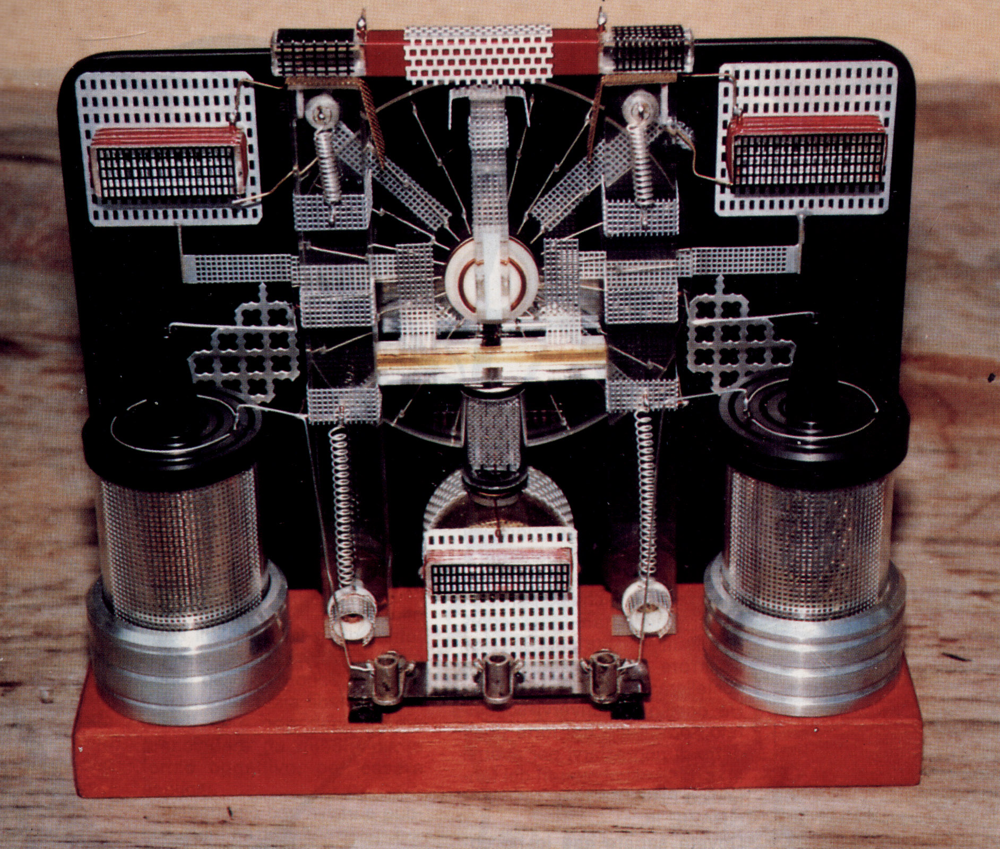
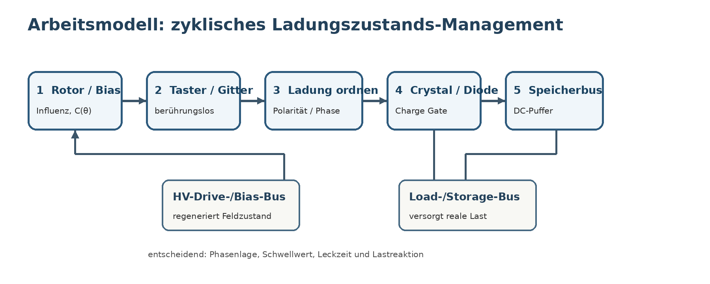

# Testatika neu gelesen

## Was Paul Baumanns eigentümliche Erklärsprache technisch bedeuten könnte

**Beitragsvorschlag für das NET-Journal – zur redaktionellen Prüfung, nicht als bereits erschienener NET-Journal-Artikel**

*Eine quellenkritische Rekonstruktion aus Marinov, Holzherr, Methernitha und den erhaltenen Werkstattgesprächen*

> **Vorspann.** Die Testatika ist seit Jahrzehnten von zwei gegensätzlichen Erzählungen umgeben: Für die einen ist sie ein Beleg für eine unbekannte Energiequelle, für die anderen lediglich eine raffinierte Influenzmaschine. Eine erneute Auswertung der Original- und Augenzeugenquellen verschiebt die entscheidende Frage. Nicht die Erzeugung hoher Spannung war offenbar Baumanns Hauptproblem, sondern deren zyklische Aufrechterhaltung bei gleichzeitiger Ladungsentnahme. Übersetzt man Begriffe wie „Wolke und Erde“, „Taster“, „Ladungen ordnen“ oder „die Diode hält den Zyklus im Takt“ in Ingenieurssprache, entsteht erstmals ein zusammenhängendes, messbares Arbeitsmodell – ohne vorschnell neue Physik anzunehmen.



*Abb. 1: Historische Aufnahme einer Testatika-Variante. Das Bild dient hier als Forschungs- und Illustrationsmaterial; Quelle und Abdruckrechte sollten vor einer Veröffentlichung redaktionell abschließend geprüft werden.*

**Die neue Ausgangslage.** Das offene Forschungsarchiv zur kleinen Testatika wurde deutlich erweitert. Im Zentrum steht die etwa 20 cm große Ein-Scheiben-Maschine, die Stefan Marinov Ende der 1980er Jahre selbst untersuchte. Marinov ist als Quelle besonders wertvoll, weil er einerseits direkt am Gerät war, andererseits seine eigene Grenze ungewöhnlich klar benannte: Er kannte weder den exakten Schaltplan noch das vollständige Wirkprinzip und konnte die Maschine nicht reproduzieren.[1]

Gerade diese Grenze ist wichtig. Sie erlaubt, Beobachtung und Legende zu trennen. In der aktuellen Rekonstruktion werden daher vier Ebenen strikt auseinandergehalten: was am Gerät gesehen wurde, was Baumann oder Methernitha sagten, was Marinov daraus folgerte und was spätere Autoren hineininterpretierten. Diese Trennung führt zu einem unerwartet klaren Ergebnis: Das wahrscheinlich zentrale Problem der Testatika liegt weniger in einer geheimen Tesla-Spule oder in Permanentmagneten, sondern in der Steuerung von Ladungszuständen, Phasen und Rückkopplung.

## 1. Die Quellenkorrektur: die „unbekannte Sprache“

Eine oft wiederholte Aussage lautet, Baumann habe Marinov die Maschine erklärt, doch für Marinov habe das wie eine unbekannte Sprache geklungen. Für diese Formulierung ließ sich jedoch kein belastbares direktes Marinov-Zitat nachweisen. Belegt sind stattdessen drei getrennte Sachverhalte:

- Marinov verstand das vollständige Funktionsprinzip und die exakte Verschaltung nicht.[1]
- Hans Holzherr berichtete nach der Vorführung von 1999, Baumann sei schwer zu verstehen gewesen, weil er leise und schnell sprach und seine Erklärungen in nicht-wissenschaftlichen Begriffen gab.[2]
- Methernitha selbst schrieb sinngemäß, die übliche physikalische Terminologie reiche zur Beschreibung der Maschine nur teilweise aus und verwendete eigene Begriffe wie „Taster“ bzw. in englischen Übersetzungen „antenna keys“.[3]

Die spätere Paraphrase ist also nachvollziehbar, aber quellenkritisch falsch zugeordnet. Das eigentliche Problem war nicht, dass Baumann angeblich eine geheime Fremdsprache sprach. Vielmehr verwendete die Gruppe eine stark anschauliche, teils eigene Terminologie für einen elektrostatischen Prozess, den selbst technisch versierte Besucher nur bruchstückhaft nachvollziehen konnten.

> **Warum diese Korrektur mehr als Wortklauberei ist.** Wenn eine ungewöhnliche Formulierung fälschlich als Marinov-Zitat gilt, kann daraus schnell der Eindruck entstehen, Baumann habe absichtlich verschlüsselt gesprochen. Trennt man die Quellen, ergibt sich ein sachlicheres Bild: Marinov verstand die Schaltung nicht; Holzherr hatte Sprach- und Terminologieprobleme; Methernitha verwendete bewusst anschauliche Eigenbegriffe. Genau diese Begriffe lassen sich heute technisch testen.

## 2. Baumanns Vokabular in Ingenieurssprache

Die erhaltene Methernitha-Beschreibung liest sich auf den ersten Blick fast naturphilosophisch. Doch viele Begriffe können ohne Bedeutungsverlust in klassische Elektrostatik übersetzt werden. Die folgende Tabelle zeigt die derzeit konservativste technische Lesart.

| Historischer Begriff | Technische Übersetzung | Was man messen müsste |
|---|---|---|
| „Erde / Wolke“ | zwei entgegengesetzte Potential- oder Feldreservoirs | Potentiale, Feldverteilung, Polarität |
| „Gitter hält Ladung“ | feldformende/floating kapazitive Elektrode | Kapazität, Oberflächenpotential, Corona |
| „Taster“ | berührungsloser Influenz-/Kapazitätsabnehmer | induzierter/displacement current vs. Rotorwinkel |
| „Ladungen ordnen“ | polaritäts- und phasenabhängiges Charge Routing | Stromrichtung und Knotenpotential vs. Winkel |
| „Diode hält Takt“ | phasenselektives Ladungsventil / elektrostatischer Kommutator | Leitphase, Schwellwert, Drehmoment |
| „langsam und gleichmäßig“ | Anpassung an RC-, Leck- und Corona-Relaxationszeiten | Drehzahlsweep + Phasenlage |
| „Gitterkondensator“ | Ladungsspeicher / DC-Puffer | C, Leck, Lade-/Entladekurve |
| „Leistung aufbauen“ | Impedanz-/Ladungsumformung, nicht automatisch Verstärkung | U(t), I(t), reale Leistung, Energiefluss |

### „Wolke und Erde“: vermutlich kein Hinweis auf atmosphärische Energie

Die Analogie lässt sich zunächst viel schlichter lesen: zwei entgegengesetzte elektrische Zustände erzeugen ein starkes Feld. Für die Rekonstruktion ist das ein bipolares Bias-System. Erst wenn eine messbare Energiezufuhr aus der Umgebung nachgewiesen würde, dürfte man aus der Wolken-Erde-Sprache auf eine externe Energiequelle schließen.[3]

### Der „Taster“: eher Feldsonde als Funkantenne

Die englische Übersetzung „antenna keys“ hat spätere HF-Deutungen begünstigt. Das deutsche Wort *Taster* ist neutraler. Da die Elektroden die Scheibe nach Marinov und Hauser nicht berühren, passt der Begriff eines nichtkontaktierenden kapazitiven oder Influenz-Abnehmers deutlich besser. Er kann Ladung induzieren, Verschiebungsstrom aufnehmen oder – bei Ionisation – auch Raumladung sammeln.[1]

### „Ladungen ordnen“: wahrscheinlich der Übergang vom Feld zum gerichteten Strom

Wenn ein Rotor an festen Elektroden vorbeiläuft, entstehen wechselnde Potentiale und Ladungsverschiebungen. „Ordnen“ lässt sich deshalb als polaritäts- oder phasenabhängige Zuordnung zu verschiedenen Knoten verstehen. Genau hier wird die Rolle des oberen „Crystal“ technisch interessant.[3]

## 3. Der „Crystal“: möglicherweise kein Ausgangsgleichrichter, sondern Kommutator

Marinov betonte, Baumann habe ihm gegenüber von einem „crystal“ gesprochen. Andere Zeichnungen nennen das obere Bauteil dagegen „rectifier“. Die institutionelle Methernitha-Erklärung schreibt der Gleichrichterdiode eine ungewöhnliche Aufgabe zu: Sie solle die Anziehungs- und Abstoßungszyklen stabil halten. Das spricht gegen die triviale Vorstellung, es handle sich lediglich um einen Gleichrichter ganz am Ausgang.[1][3]

Technisch könnte ein solcher Knoten als phasenselektives Ladungsventil arbeiten. Der Rotor verändert die Kapazität zu den festen Elektroden. Ein floating Knoten baut dadurch Spannung auf. Erst wenn ein Schwellwert erreicht ist, wird über Diode oder Kristall Ladung in einen anderen Speicher verschoben. Danach sperrt der Pfad wieder. Aus einem symmetrischen Wechsel kann so ein gerichteter Ladungszyklus werden.

> **Der entscheidende Perspektivwechsel.** Der Crystal muss nicht primär „Energie erzeugen“. Seine wichtigere Rolle könnte darin liegen, festzulegen, **wann** Ladung fließen darf. In einer elektrostatischen Maschine entscheidet die Phasenlage zwischen Rotorwinkel, Ladungszustand und Elektrodenpotential direkt über das Vorzeichen des Drehmoments und über die Rückwirkung einer Last.

## 4. „Langsam und gleichmäßig“: warum die Drehzahl Teil der Schaltung sein kann

Historische Angaben zur Drehzahl schwanken erheblich. Holzherr beobachtete 1999 an der 50-cm-Maschine etwa 15 U/min, andere Quellen nennen größere Werte. Das muss kein Widerspruch sein. Wenn die elektrischen Knoten über Widerstände, Leckpfade und Kapazitäten relaxieren, existiert eine charakteristische Zeitkonstante:

`τ = R × C`

Ist der Rotor zu schnell, erreicht ein Knoten seinen vorgesehenen Schwellwert möglicherweise nicht. Ist er zu langsam, kann die Ladung vor dem nächsten Schritt wieder weglecken. Dazu kommen Oberflächenleitung in PMMA, Corona- und Ionentransport. Genau deshalb ist die historische Aussage, die Maschine müsse langsam und sehr gleichmäßig laufen, technisch bemerkenswert. Sie passt zu einem phasenabhängigen Ladungszustandsautomaten wesentlich besser als zu einer simplen 50-Hz-Generatorinterpretation.[3][7]

## 4a. Neue Kernhypothese: positive Rückkopplung und phasenabhängige Kommutation

Die bemerkenswerteste Formulierung der Methernitha-Beschreibung ist nicht nur, dass eine Diode gleichrichtet. Sinngemäß wird ihr zugeschrieben, den Anziehungs-/Abstoßungszyklus in einem stationären Zustand zu halten; ohne diese Wirkung würden sich die Impulse weiter aufsummieren und die Scheiben schneller laufen.[3] Nimmt man diese Aussage technisch ernst, liegt ein **selbsterregtes elektromechanisches System** näher als eine gewöhnliche Ausgangsgleichrichtung.

Das Minimalmodell lautet:

`ω → C(θ) → Q,V → τ_el → ω`

Die Bewegung verändert die Kapazitätsmatrix, dadurch ändern sich Ladung und Spannung, diese erzeugen wiederum elektrostatisches Drehmoment und verändern die Bewegung. Die Grundgleichungen sind:

`Q = C(θ) · V`

`τ_el ≈ 1/2 · V² · dC/dθ`

Entscheidend ist daher nicht nur die Höhe der Spannung, sondern **zu welchem Rotorwinkel** ein Knoten geladen, entladen, weitergeschaltet oder gesperrt ist.

### Warum eine Aufschaukelung möglich ist

Über eine vollständige Umdrehung kann man die dem Rotor zugeführte elektrostatische Arbeit schreiben als:

`ΔE_Rotor = ∮ τ_el(θ) dθ`

Bleibt dieses Integral nach Reibungs-, Luft- und elektrischen Verlusten positiv, erhält der Rotor pro Umdrehung zusätzliche kinetische Energie:

`E_rot,n+1 = E_rot,n + ΔE_el − E_Verlust`

Solange `ΔE_el > E_Verlust` gilt, steigt die Drehzahl. Das ist **positive Rückkopplung / Selbstanregung**. Dafür braucht man zunächst keine klassische LC-Resonanz.

### Die Diode bzw. der „Crystal“ als Kommutator

In diesem Modell bestimmt der nichtlineare Knoten, wann Ladung zwischen Knoten fließen darf. Damit beeinflusst er direkt die Drehmomentkurve `τ(θ)`.

Ohne wirksames Gating könnte ein Zyklus qualitativ so aussehen:

```text
A: laden → antreiben
B: Ladung bleibt / nächste Feldlage → erneut antreiben
C: neue Influenz → weiterer positiver Impuls
… → positive Impulse können sich aufsummieren
```

Mit phasenabhängigem Gating:

```text
A: laden
B: antreiben
C: Ladung übertragen
D: Rückstrom sperren / Zustand zurücksetzen
A: definierter neuer Zyklus
```

Wenn der „Crystal“ eine nichtlineare Kennlinie `I = f(V)` besitzt und beispielsweise erst oberhalb eines Schwellwertes `V_th` leitet, kann er gleichzeitig **Polarität, Schwellwert und indirekt Rotorphase** auswählen. Aus einem gewöhnlichen Gleichrichter wird dann funktional ein winkelabhängiger elektrostatischer Schalter.

### Resonanz? Eher Phasensynchronisation

Eine echte LC-Eigenresonanz ist durch die historische Diode-Aussage nicht belegt. Plausibler ist ein phasensynchroner Arbeitspunkt:

`T_Segment ~ τ_RC = R · C`

Hinzu kommen Oberflächenleckage, dielektrische Relaxation, Corona-/Ionentransport und die Schwellkennlinie des Crystal-Knotens. Bei einer optimalen Drehzahl `ω*` stimmen Rotorphase und Ladungsphase so überein, dass positive Drehmomentimpulse maximiert und ungünstige beziehungsweise bremsende Zustände unterdrückt werden. **„Phasensynchrone elektrostatische Selbstanregung“** ist daher die präzisere Arbeitshypothese als „Resonanz“, solange keine echte LC-Resonanz gemessen ist.

### Analogie: Pendel mit Hemmung

Eine hilfreiche mechanische Analogie ist ein Pendel, das bei jedem Durchgang im richtigen Moment einen kleinen Schubs erhält. Solange die zugeführte Energie pro Zyklus größer als die Verluste ist, wächst seine Bewegungsenergie. Eine Hemmung oder ein phasenrichtiges Ventil begrenzt und synchronisiert die Energieübertragung. Übertragen auf die Testatika wäre der Rotor der mechanische Phasengeber, die Influenz erzeugt den elektrischen Zustand, Crystal/Diode wirkt als Hemmung beziehungsweise elektrostatischer Kommutator, Kondensatoren speichern Ladung, Gitter formen das Feld und die Taster nehmen Ladungsänderungen ab.

Diese Analogie erklärt, warum der Satz „ohne Diode wird sie immer schneller“ technisch sinnvoll sein kann, ohne schon eine klassische Resonanz vorauszusetzen: Ein positiver Zyklusimpuls kann sich von Umdrehung zu Umdrehung aufaddieren, bis Verluste oder Kommutation einen stationären Zustand herstellen.

### Moderne elektrostatische Analogien

Die Kombination **variable Kapazität + Dioden + Kondensatoren + phasenabhängige Ladungszustände** ist kein exotisches Konzept. Moderne elektrostatische Energy-Harvesting-Schaltungen verwenden passive Dioden-/Kondensatornetzwerke, um Lade- und Entladezustände mit einer mechanischen Kapazitätsänderung zu synchronisieren. Selbstpriming-Schaltungen für dielektrische Elastomergeneratoren wechseln passiv zwischen Ladungsabgabe und Ladungsaufnahme synchron zur Kapazitätsänderung; MEMS-Generatoren werden mit Dioden-/Kondensator-Spannungsvervielfachern und charge-pump-artigen Q-V-Zyklen analysiert.[11][12]

Diese Arbeiten erklären **keine Testatika-Overunity**. Im Gegenteil: Sie zeigen, dass die vermutete Kommutations- und Rückkopplungsarchitektur vollständig innerhalb etablierter Elektromechanik formulierbar ist. Die mechanische beziehungsweise externe Energiequelle bleibt bei diesen Systemen ausdrücklich Teil der Energiebilanz.

### Zwei energetisch verschiedene Kreise

Diese Interpretation ist auch für die Leistungsfrage wichtig. Wenn reale Lasten im Bereich hunderter Watt oder mehr zugeschaltet werden konnten, ohne dass die Rotoren sichtbar stark abbremsten, wären die Scheiben als direkter mechanischer Leistungsgenerator schwer zu verstehen. Plausibler wäre eine Funktion als **Taktgeber, parametrischer Schalter oder elektrostatischer Kommutator**.

```text
STEUER-/DRIVE-KREIS
Rotor → C(θ) → Gitter/Taster → Crystal/Diode
  ↑                              │
  └──── elektrostatisches τ ─────┘

LEISTUNGS-/STORAGE-KREIS
externe Quelle ? → Kondensatoren / Wandler → Last
                         ↑
                  vom Rotor getaktet
```

Eine kleine Steuerleistung kann einen wesentlich größeren Energiefluss schalten, wie ein Transistor eine große Last steuern kann. Der Schalter erzeugt diese Energie jedoch nicht. Bei stationärem Betrieb bleibt zwingend:

`P_Quelle ≥ P_Last + P_Verluste`

Die neue Hypothese kann damit eine **schwache Last-Rotor-Kopplung** erklären, aber nicht die Quelle einer behaupteten Dauerleistung. Eine zusätzliche LC-Resonanz in den Spulen/Kondensatoren der großen Maschine bleibt möglich, ist jedoch bislang nicht ausreichend belegt.[6]

## 5. Das Principle Experiment: Warum „Gitter statt Folie“ ein Schlüsselhinweis sein könnte

Hans Holzherr beschrieb 1999 einen einfachen Vorversuch Baumanns: Plexiglas, perforierte bzw. gitterförmige Metalllagen, mehrere Platten, zwei Kondensatoren und ein hin- und herbewegter Arm. Nach mehreren Bewegungen zeigte das Messgerät eine Gleichspannung; beim Kurzschluss war ein Knall zu hören. Besonders wichtig ist die Baumann zugeschriebene Aussage, dass eine geschlossene Metallfolie anstelle des Drahtgitters den Effekt nicht in gleicher Weise hervorbringe.[2][4]

Dieser Satz ist experimentell viel wertvoller als eine allgemeine „Freie-Energie“-Behauptung. Ein Gitter verändert gegenüber einer Vollfolie gleichzeitig Randlänge, Feldgradienten, Corona-Onset, Ionentransport, lokale Kapazität und die Kopplung an die Dielektrikumsoberfläche. Moderne Corona-Forschung zeigt tatsächlich, dass die Gittergeometrie die Strom-Spannungs-Kennlinie und die Stromdichteverteilung deutlich beeinflussen kann.[8]

Damit entsteht ein klarer Test: gleiche Außenkontur, gleicher Abstand, gleiche Spannung – einmal Vollfolie, einmal definiertes Gitter. Gemessen werden Kapazität, Leckstrom, Corona, Oberflächenpotential, Ladung pro Zyklus und Drehmoment. Ein Unterschied wäre zunächst ein klassischer Elektrostatikbefund, könnte aber exakt zeigen, warum Baumann diese Bauform für unverzichtbar hielt.

## 6. Der vielleicht wichtigste Werkstatthinweis: „Die Spannung aufrechterhalten“

Ein erhaltenes Amateurvideo mit Luzi Cathomen ist **keine Baumann-Aussage** und muss auch so behandelt werden. Als Einblick in das Werkstattdenken der Methernitha-Gruppe ist es dennoch außerordentlich aufschlussreich. Cathomen beschreibt den Ausgangspunkt mit elektrostatisch geladenen Schallplatten: Beim einfachen Schulversuch erhalte man einmal Spannung, einen kurzen „Klapf“, und danach sei sie weg. Im Gespräch wird daraus die zentrale Entwicklungsfrage: Wie hält man diese Spannung aufrecht?[5]

Diese Formulierung verschiebt den Fokus. Die Erzeugung hoher elektrostatischer Spannung ist mit einer Influenzmaschine seit dem 19. Jahrhundert bekannt. Schwierig ist etwas anderes: einen geladenen Zustand zyklisch zu regenerieren, dabei mechanisches Drehmoment zu erhalten und gleichzeitig Ladung an eine externe Last abzugeben, ohne dass der Bias sofort zusammenbricht.

Cathomen beschreibt bei größeren Werkstattmaschinen außerdem einen Weg, bei dem die Energie an zwei Polen aufgenommen, nach oben geführt, dort in einer schwer verstandenen Stufe „verstärkt“ bzw. die „Kapazität“ erhöht und anschließend wieder nach unten in Kondensatoren gespeichert werde. Diese Sprache beweist keine Energievermehrung. Sie passt aber zu einer nachgeschalteten Impedanz- oder Ladungsumformung in einem gepulsten, DC-vorgespannten System.[5]

## 7. Marinov war wahrscheinlich näher dran, als sein Scheitern vermuten lässt

Marinovs eigene Hauptidee war erstaunlich schlicht: eine Influenzmaschine, gekoppelt mit einem elektrostatischen Motor. Er vermutete, dass dieselbe Rotorstruktur sowohl Ladung erzeugt bzw. verschiebt als auch über passende Elektroden ein Drehmoment erhält. Zusätzlich dachte er über zwei elektrisch verschiedenartige Kreise nach: einen hochspannenden Drive-Kreis und einen niedriger gespannten, kapazitätsstärkeren Collecting-/Speicherkreis.[1]

Genau hier liegt vermutlich der Punkt, an dem ein grobes Blockbild noch nicht zur funktionierenden Maschine wird. Es fehlen die exakten Elektrodenwinkel, Floating-Knoten, Schwellen, Ladungswege, Drahtführungen und Kommutationsphasen. Marinov konnte mit seiner eigenen Influenzmaschine den behaupteten hohen Strom nicht reproduzieren. Das ist eine starke Gegeninformation gegen die einfache These „Influenzgenerator plus Motor reicht bereits aus“.[1]



*Abb. 2: Das derzeit kohärenteste Arbeitsmodell. Es ist keine historische Originalschaltung, sondern eine aus den Quellen abgeleitete, falsifizierbare Funktionsarchitektur.*

## 8. Das neue Arbeitsmodell: Charge-State-Management statt „geheime Spule“

Aus den inzwischen getrennten Quellen ergibt sich als derzeit kohärenteste technische Synthese:

1. **Priming/Bias:** Eine Anfangsladung oder ein elektrostatischer Startzustand erzeugt das notwendige Feld.
2. **Variable Kapazität:** Durch die Rotation ändert sich die Kapazitätsmatrix zwischen Rotorsegmenten und festen Elektroden.
3. **Berührungslose Aufnahme:** Taster/Gitter erhalten induzierte bzw. Verschiebungsströme, ohne den Rotor zu berühren.
4. **Ladung ordnen:** Die wechselnden Ladungszustände werden polaritäts- und phasenabhängig auf verschiedene Knoten verteilt.
5. **Crystal-Kommutation:** Ein nichtlinearer Pfad leitet nur in geeigneten Rotorphasen und verhindert Rückfluss.
6. **Zwei funktionelle Busse:** Ein HV-Drive-/Bias-Bus kann den Feldzustand für das Drehmoment erhalten, während ein Load-/Storage-Bus Ladung für die Last sammelt.
7. **Pufferung / Umformung:** Kondensatoren glätten die Impulse; größere Maschinen können weitere kapazitive oder induktive Impedanzstufen besitzen.

Mathematisch ist das eine Mehrknotenmaschine. Für einen Leiterknoten *i* gilt vereinfacht:

`Q_i = Σ_j C_ij(θ) · (V_i − V_j)`

Damit folgt `I_i = dQ_i/dt`. Strom entsteht also nicht nur durch eine Spannungsänderung, sondern auch dadurch, dass sich die Kapazität mit dem Rotorwinkel ändert. Das elektrostatische Drehmoment hängt entsprechend von der Ableitung `dC/dθ` ab. Fügt man eine Diode oder einen nichtlinearen Kristallknoten hinzu, wird aus dem linearen Netzwerk ein phasenselektiver Ladungsautomat. Genau das ist eine plausible technische Übersetzung der historischen Begriffe „ordnen“, „gleichrichten“ und „im Takt halten“.[6]

## 9. Was sich durch die neue Analyse deutlich verschoben hat

- **Tesla-/HF-Kernthese:** für die kleine Maschine deutlich herabgestuft. Marinov beschrieb die kleinen bzw. geöffneten Seitenmodule als kapazitive Strukturen und widersprach einer universellen Tesla-Deutung.
- **50/60-Hz-Erklärung:** nicht als Grundprinzip haltbar. Segmentzahlen und Drehzahlen variieren; der historische Ausgang wird als DC beschrieben.
- **Permanentmagnete:** nicht universal. Sie erscheinen bei einigen Varianten, fehlen bei anderen; damit sind sie als fundamentale Energiequelle unplausibel.
- **Crystal:** deutlich wichtiger als zuvor – weniger als mystischer Energieträger, mehr als möglicher nichtlinearer Kommutationsknoten.
- **Rotor-Drahtführung:** hochprioritär. Marinov betonte die Bedeutung der Führung durch die Scheibe; Holzherr berichtet bei mehreren Maschinen eingewebte Leiter mit mehrfachen Seitenwechseln.
- **Gittergeometrie:** hochprioritär. Baumanns Hinweis „Gitter statt Folie“ ist konkret, testbar und mit bekannter Corona-/Feldphysik vereinbar.
- **Zentrale Entwicklungsfrage:** wahrscheinlich Bias-Erhaltung und Lastreaktion: Wie bleibt die elektrostatische Spannung bestehen, während reale Ladung entnommen wird?

## 10. Und die behaupteten Kilowatt?

Hier muss die Quellenanalyse besonders streng bleiben. Mehrere Besucher sahen eindrucksvolle Lastdemonstrationen; Holzherr berichtet 1999 etwa von einer nominellen 1000-W-Lampe für rund zehn Sekunden und von einem schnell heiß werdenden Heizelement. Solche Beobachtungen sind historisch relevant, aber noch keine geschlossene Energiebilanz.[2]

Eine 1000-W-Last für zehn Sekunden entspricht lediglich etwa 2,8 Wh. Diese Energiemenge kann prinzipiell in vergleichsweise kleinen voraufgeladenen Speichern stecken. Andererseits ist die Rotationsenergie der sichtbaren leichten Scheiben viel zu klein, um solche Lasten aus ihrem Schwung zu speisen. Bei den behaupteten Kilowattleistungen und nur 15 bis 60 U/min wäre außerdem ein enormes mechanisches Drehmoment erforderlich, wenn die Scheiben selbst die Leistung mechanisch liefern sollten.

Die neue Funktionshypothese löst dieses Energieproblem nicht – und soll es auch nicht wegdefinieren. Sie erklärt, wie die sichtbare elektrostatische Architektur als Regel- und Ladungsnetzwerk funktionieren könnte. Ob darüber hinaus eine unbekannte Energiequelle existierte, eine verborgene konventionelle Quelle beteiligt war oder historische Leistungsangaben überschätzt wurden, ist durch die vorhandenen Dokumente nicht entschieden.

> **Der entscheidende moderne Test.** Nicht Leerlaufspannung ist die entscheidende Größe, sondern die Lastreaktion: Wenn reale Ausgangsleistung entnommen wird, steigt dann das mechanische Bremsmoment? Muss der Bias-Kreis zusätzliche Energie nachliefern? Sinkt gespeicherte Feldenergie? Oder erscheint eine messbare externe Energiezufuhr? Erst eine simultane Bilanz dieser Größen kann zwischen normaler elektromechanischer Umwandlung und einer echten Anomalie unterscheiden.

## 11. Welche Experimente jetzt wirklich weiterhelfen

- **Phasenaufgelöste Knotenkarte:** Rotor langsam von Hand drehen und Potential/Polarität jedes Taster-/Gitterknotens über 360 Grad erfassen.
- **Crystal-Gate-Test:** Leitbeginn, Sperrphase und Rückfluss eines definierten nichtlinearen Knotens gegen Rotorwinkel messen.
- **Zwei-Bus-Test:** Drive-/Bias- und Load-/Storage-Kreis getrennt belasten und gegenseitige Rückwirkung erfassen.
- **Gitter-vs.-Folie:** bei identischer Geometrie verblindet vergleichen: C, Leck, Corona, Ladungsimpuls, Torque.
- **Drahtführung:** verschiedene Through-disc-Routen und Leiterwerkstoffe bei identischer Elektrodengeometrie vergleichen.
- **Feuchte:** PMMA-Oberflächenpotential, Leck und Drehmoment in definierten RH-Stufen messen.
- **Shield-Plate-Test:** Marinovs Bericht, dass eine Metallplatte hinter der kleinen Maschine Rotation und Restdrehmoment beeinflusste, quantitativ reproduzieren.
- **Energiebilanz unter Last:** mechanische Leistung, Biasleistung, Anfangs-/Endspeicher und reale Lastleistung gleichzeitig integrieren.

## 12. Fazit: Vielleicht war Baumanns „Geheimnis“ zunächst ein Regelproblem

Die neuen Quellen liefern keinen fertigen Originalschaltplan. Sie liefern aber etwas wissenschaftlich fast ebenso Wertvolles: eine deutlich schärfere Fragestellung. Baumanns ungewöhnliche Begriffe lassen sich zu einem konsistenten technischen Bild zusammensetzen, in dem variable Kapazität, berührungslose Influenzabnahme, polaritätsselektive Ladungswege, ein nichtlinearer Crystal-Knoten, Speicher und eine phasenrichtige Rückkopplung zusammenarbeiten.

Damit könnte das eigentliche konstruktive Kunststück der Testatika darin gelegen haben, den elektrostatischen Zustand nicht nur einmal aufzubauen, sondern ihn zyklisch so zu regenerieren, dass Drehmoment und Ladungsentnahme gleichzeitig möglich werden. Die neue Rückkopplungsanalyse verschärft diese Hypothese: **Ohne geeignete Phasenkommutation kann sich ein positiver Drehmomentzyklus aufschaukeln; mit Crystal-/Dioden-Gating kann ein definierter, stabiler Ladungs- und Drehmomentzyklus entstehen.** Das ist zunächst ein Regelungs- und Kommutationsproblem, nicht der Nachweis einer besonderen Energiequelle.

Ob diese Regelarchitektur nur eine raffinierte klassische elektrostatische Maschine ergibt oder ob die historischen Geräte darüber hinaus tatsächlich eine ungewöhnliche Nettoenergiequelle nutzten, bleibt offen. Die gute Nachricht ist: Die Frage ist heute weniger mystisch als früher. Sie lässt sich in konkrete Knoten, Phasen, Ladungen, Drehmomente und Energieflüsse zerlegen – und damit experimentell entscheiden.

> **Offenes Forschungsarchiv.** Die quellenkritische Wissensbasis, CAD-Rekonstruktionen, Evidenzmatrix, das Statement-Ledger zu Baumann/Methernitha und die aktuellen Experimentpläne stehen im öffentlichen Repository `github.com/inetconnector/testatika-small-research-replica`. Die Dokumentation unterscheidet systematisch zwischen beobachtet, von Quellen behauptet, abgeleitet und hypothesiert.

## Quellen und weiterführende Literatur

[1] Stefan Marinov: *The Thorny Way of Truth, Part V*. Graz, 1989. Internet Archive: https://archive.org/details/thornywayoftruthpart5maririch  
[2] Hans Holzherr: Bericht über die Testatika-Vorführung vom 5. Juni 1999; englische Übersetzung/Verbreitung Stefan Hartmann, 4. August 1999: https://rimstar.org/sdenergy/testa/report99.htm  
[3] Methernitha: historische technische Beschreibung der Thesta-Distatica, archivierte Wiedergabe: https://rimstar.org/sdenergy/testa/methernitha_testatika_technical_info.htm  
[4] Testatika Principle Experiment: https://rimstar.org/sdenergy/testa/principleexp.htm  
[5] Projekt-Dokument: Baumanns Erklärsprache entschlüsselt: `docs/research/baumann-language-decoding.md`  
[6] Projekt-Dokument: Scientific status: `docs/scientific-status.md`  
[7] *Charge storage and transport in PMMA film*, Journal of Electrostatics 44 (1998), DOI 10.1016/S0304-3886(98)00023-0.  
[8] *Effects of the grid geometry on the performances of a triode-type corona electrode system*, Journal of Electrostatics 101 (2019), DOI 10.1016/j.elstat.2019.103367.  
[9] Heinrich Wommelsdorf: historische Kondensator-/Influenzmaschinen; Übersicht: https://www.coe.ufrj.br/~acmq/wommelsd.html  
[10] GitHub-Forschungsrepository: https://github.com/inetconnector/testatika-small-research-replica  
[11] Patrin Illenberger et al.: *More power to the people: getting the most from a dielectric elastomer generator*. arXiv:1603.01637 (2016): https://arxiv.org/abs/1603.01637  
[12] Binh Duc Truong, Cuong Phu Le, Einar Halvorsen: *Analysis of MEMS electrostatic energy harvesters electrically configured as voltage multipliers*. arXiv:1709.08759 (2017): https://arxiv.org/abs/1709.08759

---

**Redaktioneller Hinweis:** Dieser Text ist ein **Beitragsvorschlag für das NET-Journal**. Er wurde nicht im Auftrag des NET-Journals erstellt und ist zum Zeitpunkt dieser Fassung kein veröffentlichter Artikel des NET-Journals.
