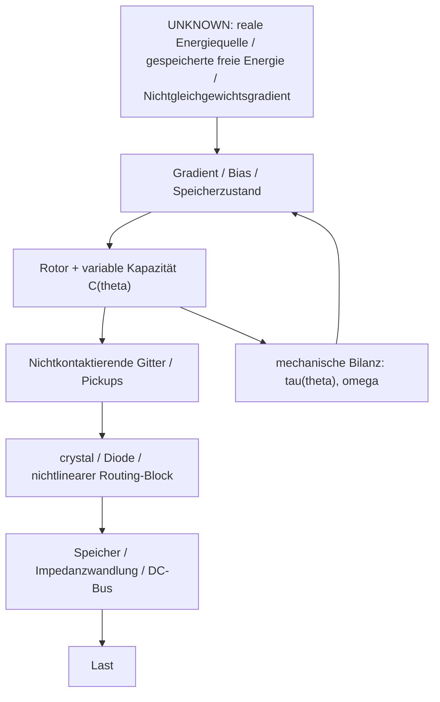

# Das physikalische Funktionsmodell der Testatika: quellenkritische Synthese und offene Energiebilanz

**Dokument-ID:** `DOC-METHERNITHA-PHYSICS-2026-08-23`  
**Projekt:** `inetconnector/testatika-small-research-replica`  
**Datum:** 23. August 2026  
**Status:** **WISSENSCHAFTLICHES ARBEITSMODELL / HYPOTHESENGETRENNT — Bulk-Energieursprung UNKNOWN**  
**Basisevidenz:** Transkripte `Meth_1.avi` bis `Meth_6.avi` (16. Juli 1990, Linden BE), Weber/Schneider, Hauser, Marinov, DOE/Technidyne, Holzherr, Dienst/Cathomen, Repository-Primärscans und kontrollierte Replikations-/Bound-Dokumente  
**Ergänzender Rahmen:** [`order-non-equilibrium-framework.md`](order-non-equilibrium-framework.md)  

---

## 1. Einleitung: drei Ebenen strikt trennen

Dieses Dokument trennt künftig drei verschiedene Aussageklassen:

1. **Historische Beobachtung / Quellenbehauptung** — was Besucher, Methernitha, Baumann, Marinov, Hauser, Holzherr oder Videoquellen tatsächlich berichten.
2. **Konventionelle Funktionshypothese** — welche Teile mit Elektrostatik, variabler Kapazität, Ladungsrouting, Leckage, Corona, Dielektrika, mechanischer Arbeit oder gespeicherter Energie erklärbar sind.
3. **Energiequellenhypothese** — welcher reale Nichtgleichgewichtsgradient oder Speicher die Nutzenergie liefert.

Der wichtigste aktuelle Konsens lautet:

> **Die Testatika-Struktur kann plausibel Ladung und Feld phasenabhängig ordnen bzw. routen. Das ist noch keine Identifikation der Bulk-Energiequelle.**

Die Aussagen aus `Meth_5` über „organization / inner order“ und aus `Meth_6` über Osmose, Membranen und schwache DC-Felder werden daher als **Primärquellen für Methernithas Funktionssprache** behandelt, nicht als fertige physikalische Erklärung.

---

## 2. Gesamtarchitektur als offenes Energieflussmodell

Dieses Schema ist absichtlich anders als eine geschlossene „Selbstlauf“-Erklärung:

- `R`, `T`, `K` können **Konvertierungs-/Routingfunktionen** besitzen;
- `B` kann Energie zeitlich puffern;
- `X` bleibt so lange `UNKNOWN`, bis die Energiegrenze experimentell geschlossen ist.

---

## 3. Teilsysteme: belastbares Minimum und Hypothesen

### 3.1 Rotorsektoren als variable Kapazitätsmatrix

Beim M2 sind einzelne Cu-Leiter nach direkter Marinov-Korrespondenz bevorzugt als **floating / `connected to nothing`** zu behandeln. Bei großen Familien existieren andere Sektor- und Materialklassen; diese werden nicht nach M2 übertragen.

Jeder Rotorleiter bildet mit den stationären Elektroden eine winkelabhängige Kapazität `C_k(theta)`.

Der prinzipielle Ladungsstrom enthält Terme aus Spannungs- und Kapazitätsänderung:

`I = dQ/dt = C*dV/dt + V*dC/dt`.

Die zugehörige Feldenergie lautet:

`E_C = 1/2 * C * V^2`.

**Wichtige Energiebilanz:** Bei einem konventionellen elektrostatischen Generator stammt ein Anstieg der elektrischen Feldenergie infolge einer mechanisch erzwungenen Kapazitätsänderung aus der mechanischen Arbeit gegen elektrostatische Kräfte. Variable Kapazität ist daher ein plausibler **Wandler**, aber keine eigenständige Energiequelle.

Zu messen:

- `C(theta)`;
- `V(theta)`;
- `I(theta)`;
- Drehmoment `tau(theta)`;
- Winkelgeschwindigkeit `omega`.

---

### 3.2 Gitter / Pickups: Feldformung statt behaupteter Energieerzeugung

Quellen stützen bei mehreren Maschinenfamilien nichtkontaktierende perforierte oder gitterförmige Elektroden. Für M0 berichtet Holzherr Baumanns Aussage, geschlossene Metallfolie liefere nicht denselben Effekt wie Gitter.

Konventionell können Gitter gegenüber Folie ändern:

- lokale Feldstärke und Randfelder;
- Feldpenetration;
- Kapazitätsmatrix;
- induzierte Oberflächenladung;
- mögliche Raumladungs-/Coronawege;
- Leckage und Entladungsdynamik.

Nicht als gelöst gelten:

- dass tatsächlich kontinuierliche Mikro-Corona der Haupttransport ist;
- dass Corona „entropiearm“ ist;
- dass Gitter selbst Nettoenergie erzeugen.

**Arbeitsstatus:** `field-forming / floating pickup / possible ion-space-charge control`.

Der entscheidende Kontrollversuch ist ein geometrisch kontrollierter `mesh vs solid foil`-A/B-Test.

---

### 3.3 `crystal` / institutionelle `rectifying diode`

Die Quellenbegriffe bleiben getrennt:

- Baumann → Marinov kleine Maschinen: `crystal`, Material und Funktion unbekannt;
- institutionelle Methernitha-Beschreibung: `rectifying diode` hält den Zyklus im Takt;
- Hauser große Maschine: obere Crystal-/Rectifier-Deutung teilweise Beobachterinterpretation.

Die konservative gemeinsame Funktionshypothese lautet:

> **phasenselektives nichtlineares Ladungsventil / elektrostatischer Kommutator**.

Ein solches Element kann:

- Rückladung in ausgewählten Rotorphasen sperren;
- Ladung erst über einer Schwelle transferieren;
- floating Knoten phasenweise klemmen;
- Lastreaktion und Drehmomentphase verändern;
- einen wiederkehrenden Grenzzyklus stabilisieren.

Nicht zulässig ist die frühere zu starke Formulierung, die Diode „beseitige das Gegenmoment“ und erkläre damit bereits eine positive Nettoarbeit.

Wenn die Diode ein negatives Drehmoment reduziert, muss die Energiebilanz zeigen, **woher die Feldenergie für den entsprechenden Ladungszustand stammt**.

---

### 3.4 Seiten-Pots und große Zylinder: Maschinenfamilien trennen

#### M2 / kleine Marinov-Familie

Direkt quellenkompatibel:

- zylindrisches leitfähiges Gitter;
- Kunststoffisolation;
- zentrale Kupferspirale;
- zwei sichtbare externe Leitungen pro Pot.

`UNKNOWN` bleiben:

- exakte Kapazität;
- interne Polarität;
- Spiralwindungszahl;
- vollständige Verschaltung;
- eventuelle verborgene Material-/Speicherzustände.

Die V4.31-Abschätzung zeigt, dass die **einfache sichtbare M2-Pot-Geometrie** keinen `10 kJ`-Elektrostatikspeicher darstellen kann. Selbst eine bewusst großzügige idealisierte Koaxialgeometrie bleibt bei pF-Größenordnung und weit unter der erforderlichen Speicherenergie.

Damit ist die frühere Erklärung

`M2-pot dielectric soakage -> 10 kJ burst`

**verworfen**.

#### M6 / große Familie

Hauser, Holzherr und andere Quellen beschreiben deutlich komplexere Zylinder-/Mehrlagenstrukturen. Diese müssen separat geometrisch und elektrisch gebounded werden. Baumanns Holzherr zugeschriebene Angabe von vielen perforierten Lagen ist **M6-Familieninformation**, nicht M2-Baseline.

---

### 3.5 Selbstrotation: Beobachtung/Claim getrennt von Energieerklärung

Direkte Marinov-Korrespondenz sagt für die beschriebene kleine Maschine, es gebe keinen konventionellen eingebauten Motor; Marinov deutete die Rotation elektrostatisch. Historische Quellen berichten lange Leerlaufperioden verschiedener Maschinen.

Das erlaubt zwei Aussagen:

1. Ein eingebauter konventioneller Motor gehört nicht zur bevorzugten historischen M2-Baseline.
2. Die Energiequelle für dauerhafte elektrostatische Motorarbeit ist damit **nicht automatisch erklärt**.

Für stationäre Rotation gilt mechanisch:

`P_mech = tau * omega`.

Wenn elektrostatische Kräfte dauerhaft Reibung und Luftwiderstand überwinden, muss diese reale mechanische Verlustleistung aus einem elektrischen, chemischen, thermischen, Umwelt- oder gespeicherten Energieterm stammen.

Die korrekte Forschungsfrage ist deshalb nicht nur

`ist tau_e > tau_loss?`

sondern

`welcher gemessene Energieterm speist tau_e * omega über die Zeit?`.

---

## 4. Historische Leistungsbeobachtungen: Laufzeit ist nicht Lastzeit

| Quelle | belastbare Beobachtung | zusätzliche Behauptung / Grenze |
|---|---|---|
| Weber/Schneider 1984 | Maschine, Lampe/Heizer-Demo; Gerät soll angehoben/untersehen worden sein | Langzeit-/Leistungsangaben nicht durch kontinuierliches unabhängiges Messprotokoll geschlossen |
| Hauser 1986 | mehrstündiger Besuch; kleine Maschine lange im Leerlauf; große Lastdemo | Hauser sagt ausdrücklich, seine Messung sei ohne Widerstandslast erfolgt; Schätzleistungen sind keine geschlossene Bilanz |
| DOE/Technidyne 1988/89 | Bericht über Konverter und Gemeinschaft | Claims zu mehreren 3–4-kW-Konvertern nicht unabhängig technisch bestätigt |
| Methernitha-Film 1990 | Primärsprache zu Ordnung, Natur, Osmose/Gradienten | kein technischer Schaltplan, keine geschlossene Lastbilanz |
| Holzherr 1999 | ca. 1,5 h Maschinenlauf im Leerlauf; nominelle 1000-W-Lampe ca. 10 s; weitere kurze Lastbeobachtungen | Maschine durfte nicht vollständig untersucht werden; Laufzeit ≠ kW-Lastzeit |

### 4.1 Der nominelle `10 kJ`-Fall

Wenn eine `1000 W`-Lampe tatsächlich für `10 s` ungefähr Nennleistung aufgenommen hätte:

`E = P*t = 1000 W * 10 s = 10,000 J = 2.78 Wh`.

Das ist ein **Energieäquivalent**, keine historische Kalorimetrie. Für den Bericht fehlen zeitaufgelöste, unabhängige `u(t)`- und `i(t)`-Daten.

Daher künftig bevorzugte Formulierung:

> **„nominelles 10-kJ-Äquivalent der berichteten 1000-W-/10-s-Demonstration“**

statt

> „nachgewiesene 10-kJ-Abgabe“.

### 4.2 Speicher-/Burst-Hypothese

Ein kurzer Hochleistungsburst kann prinzipiell aus einem langsam geladenen endlichen Speicher kommen. Deshalb muss gemessen werden:

`E_store(before) -> E_store(after) -> recovery dE/dt`.

Für M2 ist die einfache sichtbare Pot-Kapazität als 10-kJ-Feldspeicher ausgeschlossen. Andere endliche Speicherklassen bleiben nur dann Kandidaten, wenn Geometrie/Material und Recovery sie unterstützen.

---

## 5. „Energie durch Ordnung“ — neue präzise Einordnung

Methernithas Sprache wird künftig in drei Stufen behandelt:

### Stufe A — Primärsprachlicher Befund

`Meth_5`: Energie / Gewinn wird mit organization / inner order verknüpft.  
`Meth_6`: Osmose, Membran, schwaches DC-Feld und Naturenergie werden analogisch verbunden.

### Stufe B — konservative technische Übersetzung

`order -> polarity sorting / charge routing / phase-selective coupling`.

Das ist mit `baumann-language-decoding.md` und `baumann-statements.tsv` konsistent.

### Stufe C — thermodynamische Randbedingung

Ordnung kann die **Nutzbarkeit vorhandener freier Energie** verändern, aber sie ersetzt keine Quelle.

Für den Testatika-Rahmen:

`reale Quelle / Nichtgleichgewichtsgradient`

`-> ordnende Testatika-Struktur`

`-> gerichteter Energiefluss`.

Mögliche Gradientklassen sind:

- mechanische Arbeit;
- gespeicherte elektrische/electretische Energie;
- chemische freie Energie;
- thermische Gradienten;
- Feuchte-/Ionen-Nichtgleichgewicht;
- atmosphärische elektrische Kopplung;
- externe RF/EM- oder andere Umweltkopplung.

Keine dieser Klassen ist derzeit als historische Bulk-Quelle bestätigt.

Details und Testmatrix: [`order-non-equilibrium-framework.md`](order-non-equilibrium-framework.md).

---

## 6. Atmosphärisches Feld: Kopplungskandidat, kein kW-Nachweis

Das globale atmosphärische elektrische System ist real und außerhalb thermischen Gleichgewichts. Typische Schönwetter-Feldstärken am Boden liegen in der Größenordnung `~100 V/m`; der vertikale Leitungsstrom liegt jedoch nur bei wenigen `pA/m²`.

Daher ist atmosphärische Kopplung als

- Priming/Bias;
- empfindliche Umweltabhängigkeit;
- Stör-/Kontrollterm

plausibel zu untersuchen.

Sie ist aber **keine plausible direkte Erklärung einer kontinuierlichen kW-Ausgangsleistung eines Tischgeräts**, solange kein separater Energieverstärkungsmechanismus mit eigener Quelle nachgewiesen ist.

---

## 7. Quanten-/Informationsthermodynamik: nur konzeptioneller Vergleich

Information und Korrelation können in wohldefinierten thermodynamischen Protokollen Arbeitspotential darstellen. Das macht „Ordnung“ als physikalischen Begriff präzisierbar.

Für die Testatika existiert jedoch keine Evidenz für:

- kontrollierte langlebige Verschränkung;
- Qubits / kohärente Register;
- Quantum Energy Teleportation;
- ein Quantenreservoir als Energiequelle.

Daher wird Quanteninformation **nicht** in die historische Maschinenbaseline oder als konkrete Bulk-Energiequellenhypothese aufgenommen.

---

## 8. Geschlossene Energiebilanz und Falsifikationskriterium

Für jeden Lasttest ist eine vollständige Systemgrenze zu verwenden:

`E_residual = E_out - E_mech,in - E_elec,in - E_thermal,in - E_EM,in - E_atmospheric,in - E_chemical,in + Delta(E_stores)`.

`Delta(E_stores)` umfasst mindestens:

- Kondensator-/Feldenergie;
- Oberflächen-/Elektretladung;
- Rotationsenergie;
- magnetische Energie;
- chemische freie Energie;
- thermische Speicher.

Ein Effekt bleibt nur dann als `UNKNOWN_POSITIVE_RESIDUAL`, wenn:

1. er wiederholbar ist;
2. deutlich über dem vollständigen Unsicherheitsbudget liegt;
3. kein ausreichender Speicher-Droop/Recovery beobachtet wird;
4. mechanische, chemische, thermische, RF/EM-, Erd-/Atmosphären- und Messgerätepfade quantitativ begrenzt sind;
5. randomisierte Kontrollen den Effekt nicht erklären.

Ein positiver Residual wäre zunächst **eine offene Messanomalie**, kein automatischer Beleg für Overunity, Vakuumenergie, ZPE oder Quantenverschränkung.

---

## 9. Priorisierte Experimente

Die neue `OQ`-Serie aus `order-non-equilibrium-framework.md` ergänzt die bestehende Replikationsmetrologie:

1. **OQ-0:** bekannte Kontrollmaschine — Nullbilanz / Messkettenvalidierung.
2. **OQ-1:** `crystal`/Diode-Phasenmatrix — `V(theta)`, `I(theta)`, `tau(theta)`.
3. **OQ-2:** Gitter vs. Folie — Feld-/Kapazitäts-/Ionen-/Leckstromvergleich.
4. **OQ-3:** Feuchte-/Ionenkonzentrationsmatrix.
5. **OQ-4:** Earth/cloud-/Umgebungskopplung mit isolierter/definierter Erde und Abschirmkontrollen.
6. **OQ-5:** Speicher-Droop und Recovery nach Lastbursts.
7. **OQ-6:** mechanische Grenzbilanz `tau * omega`.
8. **OQ-7:** Material-/Chemiekontrolle nur für klar deklarierte HYPOTHESIS-Varianten.
9. **OQ-8:** integrierter Residualtest erst nach den Einzelkontrollen.

---

## 10. Zusammenfassende Matrix

| Methernitha-/Testatika-Befund | zulässige Arbeitsübersetzung | aktueller Status |
|---|---|---|
| „Energie durch Ordnung“ | selektive Kopplung / Ladungssortierung / Phasensteuerung kann freie Energie nutzbar machen | Primärsprache belegt; Bulk-Quelle UNKNOWN |
| `rectifying diode` hält Zyklus im Takt | elektrostatischer Kommutator / charge valve | funktional testbar; keine Energiequelle bewiesen |
| `crystal` | M2-Blackbox; mögliche Nichtlinearität | Material/Funktion UNKNOWN |
| Gitter statt Folie | veränderte Feld-/Kapazitäts-/Raumladungsbedingungen | A/B-testbar |
| M2-Pots | Gitter + Kunststoff + zentrale Cu-Spirale, zwei externe Leads | Geometrieklasse gestützt; Kapazität/Wiring UNKNOWN |
| 1000-W-Lampe ~10 s | nominelles `10 kJ`-Äquivalent, falls Nennleistung | keine geschlossene historische Energiemessung |
| M2-Pots als `10 kJ`-Feldspeicher | durch V4.31-Geometriebound verworfen | ausgeschlossen für einfache sichtbare M2-Pots |
| lange Leerlaufrotation | historische Beobachtungs-/Claimlinie | Energiequelle für Verluste weiterhin offen |
| atmosphärische Kopplung | möglicher Bias-/Umweltterm | direktes kW-Potential gewöhnlicher Schönwetterströme unzureichend |
| Quantenverschränkung | konzeptionelle Informationsthermodynamik | keine Testatika-Evidenz; nicht Baseline |

---

## 11. Arbeitsfazit

Der physikalisch sauberste aktuelle Rahmen ist nicht

`mystery crystal -> freie Energie`

und auch nicht

`Ordnung -> Energie aus dem Nichts`.

Er lautet:

`UNKNOWN reale Quelle / gespeicherte freie Energie / Nichtgleichgewichtsgradient`

`-> variable Kapazität + Gitter + phasenselektives Routing`

`-> Speicher/Impedanzwandlung`

`-> Last`.

Damit bleibt ein großer Teil der sichtbaren Maschinenarchitektur mit etablierter Elektrodynamik experimentell untersuchbar, ohne die ungelöste Kernfrage zu verdecken:

> **Welcher reale Energieterm speist eine behauptete dauerhafte Nutzleistung?**

Erst eine geschlossene, reproduzierbare Bilanz kann diesen Term identifizieren oder einen belastbaren positiven Residual übriglassen.
