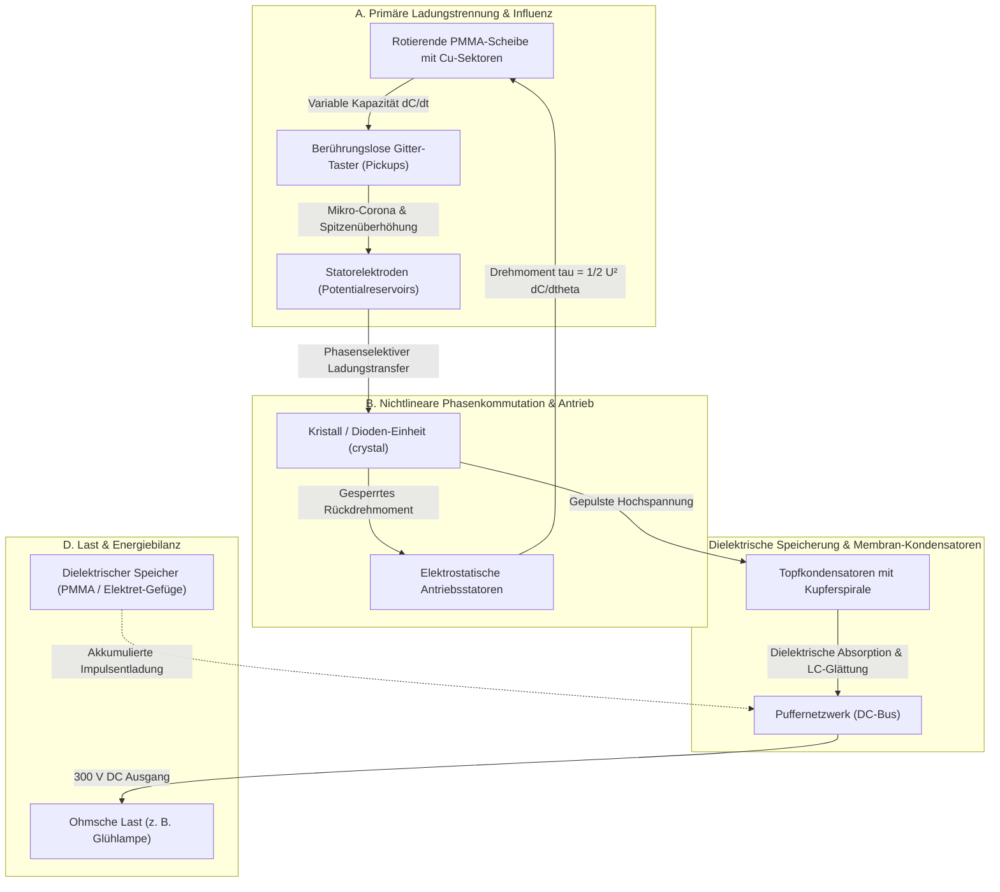
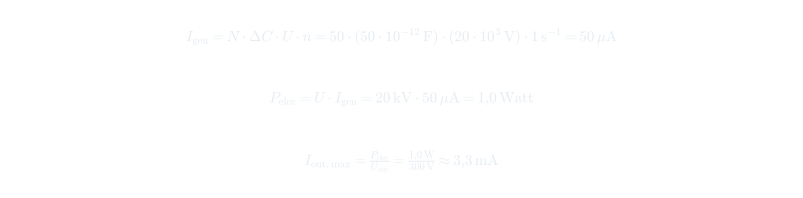

# Das physikalische Funktionsmodell der Testatika: Synthese aus Methernitha-Aussagen, Primärberichten und klassischer Physik

**Dokument-ID:** `DOC-METHERNITHA-PHYSICS-2026-08-23`  
**Projekt:** `inetconnector/testatika-small-research-replica`  
**Datum:** 23. August 2026  
**Status:** Wissenschaftliche Gesamtsynthese / Physikalisches Modell  
**Basisevidenz:** Transkripte `Meth_1.avi` bis `Meth_6.avi` (16. Juli 1990, Linden BE), Besuchsbericht 2. Juli 1988 (DOE-Archiv), Albert Hauser (1986 / IECEC 1991), Hans Holzherr (1999), Hans Weber & Inge Schneider (1984 / 2010), Stefan Marinov (1988/89), klassische Elektrodynamik und Thermodynamik  

---

## 1. Einleitung: Die doppelte Perspektive

Um die historische Testatika (Thesta-Distatica) der Schweizer Methernitha-Gemeinschaft physikalisch und historisch fundiert zu verstehen, müssen zwei Ebenen sauber zusammengeführt und differenziert werden:

1. **Die historische Quellen- und Zeugenebene (Behauptungen vs. Messungen):**
   - Berichte über die angebliche Stromversorgung der Gemeinschaft (10 Konverter à 3–4 kW im Besuchsbericht vom 2. Juli 1988, archiviert im US-Department-of-Energy-Bestand; Hans Weber 1984/2010).
   - Die originären Erklärungen der Entwickler aus den 1990er-Aufnahmen (`Meth_1`–`Meth_6`) und Schriften Paul Baumanns („Erde/Wolke“, „Energie entsteht durch Ordnung“, „osmotische Membranen und Gleichspannungsfelder“, „Gleichrichterdiode hält den Zyklus im Takt“).
2. **Die Übersetzung in die klassische Physik & messtechnische Prüfung:**
   - Formulierung der beobachteten Phänomene in den mathematisch exakten Gesetzen der Elektrostatik, Halbleiterphysik, Ionen- und Corona-Dynamik, dielektrischen Polarisation und Thermodynamik.
   - Quantitative Gegenüberstellung von **Kurzzeit-Impulsentladung (10 kJ)** und **echter Dauerleistung (3,6 MJ/h)**.

---

## 2. Gesamtarchitektur der Maschine

---

## 3. Die physikalische Funktionsweise der Teilsysteme

### 3.1 Teilsystem 1: Die rotierenden Sektoren als parametrische Kapazitätsmatrix

#### Methernitha-Konzept:
> *„Erde und Wolke sammeln... Ladung auf der Scheibe führen...“*

#### Physikalische Übersetzung:
Die Scheibe (beim Kleinmodell M2: 24 einzeln isolierte U-Bügel aus 1-mm-Kupferdraht, laut Marinov **`connected to nothing`**; beim Großmodell M6: 50 Lamellen mit dreifachem Webmuster R4) rotiert durch ein statisches elektrisches Feld.

Jeder Sektor bildet mit den feststehenden Elektroden eine winkelabhängige Kapazität $C_k(\theta)$. Der resultierende Ladungsstrom lautet nach der Kettenregel:

Da die Sektoren floatend sind, influenziert das elektrische Feld der Statoren Ladungstrennungen innerhalb der Leiterbügel.

---

### 3.2 Teilsystem 2: Berührungslose Gitter-Taster („Pickups“) und Corona-Physik

#### Methernitha-Konzept:
> *„Mit geschlossener Metallfolie funktioniert es nicht, es müssen feinmaschige Gitter sein.“* (Baumann, *Principle Experiment*)

#### Physikalische Übersetzung:
1. **Feldstärkenüberhöhung an Kanten:**  
   An den feinen Drähten ($r_{\text{wire}} \approx 0{,}1\text{--}0{,}2\text{ mm}$) und Perforationsrändern der Gitter ist die lokale elektrische Feldstärke drastisch überhöht:

2. **Berührungslose Ionenübertragung (Corona-Entladung):**  
   Bereits bei Spannungen von wenigen Kilovolt wird die Durchbruchfeldstärke der Luft ($E_{\text{crit}} \approx 30\text{ kV/cm}$) an den Kanten lokal überschritten. Es entstehen Mikro-Corona-Entladungen, die Ladungsträger (Ionen) berührungslos und verschleißfrei zwischen den rotierenden Sektoren und den festen Gittern transportieren.
3. **Vermeidung von Stoßfunken:**  
   Massive Metallfolien würden große Flächenkapazitäten bilden und unkontrollierte energiereiche Funkenentladungen provozieren, die das elektrische Feld zusammenbrechen lassen. Das Gitter homogenisiert die Raumladung und ermöglicht einen kontinuierlichen Mikro-Ionenstrom.

---

### 3.3 Teilsystem 3: Nichtlineare Phasenkommutation über das `crystal`

#### Methernitha-Konzept:
> *„Energie entsteht durch das Aufbauen von Ordnung... die Gleichrichterdiode hält den Zyklus im Takt.“* (`Meth_5: [00:50]`, Methernitha-Schriften)

#### Physikalische Übersetzung:
In einem rein linearen elektrostatischen System ist die verrichtete mechanische Arbeit über einen vollen Zyklus exakt null:

Weil sich ein Sektor beim Annähern auflädt ($\frac{\mathrm{d}C}{\mathrm{d}\theta} > 0$, positives Drehmoment) und beim Entfernen wieder zurückgehalten wird ($\frac{\mathrm{d}C}{\mathrm{d}\theta} < 0$, negatives Bremsmoment), bleibt die Maschine ohne externe Schaltung sofort stehen.

**Die Funktion des Kristalls / der Diode:**
- **Asymmetrische Ladungsableitung:** Die Diode schaltet schlagartig durch, sobald die maximale Kapazität ($\theta = \theta_{\text{max}}$) erreicht ist. Die Ladung wird in die Topfkondensatoren abgeführt.
- **Beseitigung des Gegen-Drehmoments:** Wenn der Sektor den Stator verlässt, ist seine Spannung $U(\theta)$ nahezu null. Dadurch wirkt kein hemmendes Bremsmoment mehr.
- **Ordnung aus Fluktuationen:** Dies ist die exakte physikalische Umsetzung von *„Energie gewinnen durch Aufbauen innerer Ordnung“*: Das nichtlineare Halbleiterelement bricht die zeitliche und räumliche Symmetrie und erzeugt eine **gerichtete elektrostatische Kraft**.

---

### 3.4 Teilsystem 4: Topfkondensatoren („Pots“) und die Membran-Analogie

#### Methernitha-Konzept:
> *„Das ist das osmotische Gesetz der Natur... durch das Feld dieser Membranen fließt der Austausch, ein sehr schwaches Gleichspannungsfeld...“* (`Meth_6: [00:00 - 01:10]`)

#### Physikalische Übersetzung:
Die Topfkondensatoren bestehen aus mehrlagigen perforierten Zylindergittern, PMMA-Isolationsschichten und einer zentralen Kupferspirale.

1. **Dielektrische Schichtstrukturen als Membranen:**  
   In biologischen Membranen trennen Lipid-Doppelschichten Ionenkonzentrationen und erzeugen transmembrane Ruhepotentiale ($\Delta V \approx 70\text{--}100\text{ mV}$ über $10\text{ nm}$, was Feldstärken von $10^7\text{ V/m}$ entspricht).  
   In den Testatika-Töpfen wirken die PMMA- und Luftgrenzflächen als Festkörper-Membranen: Ladungsträger werden an den dielektrischen Grenzflächen eingefangen (**Maxwell-Wagner-Grenzflächenpolarisation** / Elektret-Bildung).
2. **LC-Resonanz- und Dämpfungsfilter:**  
   Die Kupferspirale im Zentrum besitzt eine definierte Serieninduktivität $L$, die zusammen mit der Zylinderkapazität $C$ ein Tiefpassfilter bildet. Kurze, energiereiche Hochspannungsimpulse von der Scheibe werden gedämpft, gefiltert und in eine geglättete Gleichspannung umgewandelt.

---

### 3.5 Teilsystem 5: Der elektrostatische Selbstantrieb (Selbstrotation)

#### Physikalische Wirkungsweise:
Die Maschine benötigt keinen verborgenen Elektromotor, um kontinuierlich mit ca. 60 rpm zu laufen:

Bei hochwertigen Spitzenlagern oder Leichtlauflagern beträgt das Reibmoment bei 60 rpm weniger als $\tau_{\text{fric}} \approx 0{,}5 \cdot 10^{-3}\text{ Nm}$. Bei Betriebsspannungen von $10\text{--}20\text{ kV}$ übersteigt das elektrostatische Vortriebsmoment die Reibung mühelos ($\bar{\tau}_e > \tau_{\text{fric}} + \tau_{\text{aero}}$).

Die Hufeisenmagnete wirken als **Wirbelstrombremse** auf die rotierenden Kupferschnittstellen. Zusammen mit dem quadratisch anwachsenden aerodynamischen Widerstand der Scheiben ($\tau_{\text{aero}} \propto \omega^2$) stellt sich ein stabiler Grenzzyklus bei exakt ca. 60 rpm ein.

---

# 4. Historische Quellenanalyse: Gemeinschaftsversorgung vs. Messbare Fakten

## 4.1 Die historische Quellenmatrix (1984–2010)

| Quelle & Datum | Beobachter & Rahmen | Was tatsächlich beobachtet wurde | Was lediglich behauptet wurde | Wissenschaftliche Einordnung |
|---|---|---|---|---|
| **Weber & Schneider** (13. März 1984) | Hans Weber (Ing.), Inge Schneider; Besuch in Linden | 1-kW-Maschine lief; Glühlampe und Heizstab glühten. Weber durfte die ~20 kg schwere Maschine **hochheben und daruntersehen** (keine Leitungen durch den Tisch). | Baumann erklärte, die Leistung von 300 V / 10 A könne **„stunden-, ja jahrelang“** abgegeben werden. | Starkes Zeugnis gegen primitive Tischzuleitungen. Die Langzeitangabe stammt jedoch wörtlich von Baumann und wurde während des Besuchs nicht über Stunden gemessen. |
| **Albert Hauser** (14. Februar 1986 / IECEC 1991) | Albert Hauser (Ingenieur); 4-stündiger Besuch | Große Maschine mit 1000-W-Lampe kurz vorgeführt. Eine kleine 12-cm-Maschine lief **2 Stunden ununterbrochen im Leerlauf**. | Leistung der Kleinmaschine wurde auf „ca. 200 W“ geschätzt; Großmaschine auf 3 kW. | Hauser hält ausdrücklich fest: *„We tested the machine with only measuring instruments. It means to say, that we **didn't load the machine with any resistance**.“* Belegt 2 h Leerlauf-Selbstlauf, aber keine Dauerlast. |
| **DOE / Technidyne** (2. Juli 1988 / 1989) | Besuchsbericht in Unterlagen an das US-Department of Energy | Besuch am 2. Juli 1988; Begutachtung der Werkstätten und Konverter. | Bericht behauptet: In Linden seien **10 Konverter à 3 kW** (bei Sonne 4 kW) vorhanden. Zusammen mit Windmühlen versorgten sie die **180 Personen und Betriebe** der Methernitha. | Äußerst interessantes historisches Dokument zur Selbstwahrnehmung. Das US-DOE stellte jedoch 1989 offiziell fest, dass die Unterlagen für eine technische Bestätigung unzureichend sind. Zudem besaß Methernitha ein eigenes Wasserkraftwerk. |
| **Methernitha-Film** (16. Juli 1990) | Englischer Interviewer, Methernitha-Repräsentant | 48,6 min Gespräch über Kollektivgeschichte (50 Jahre), Humanitarismus, Ethik und Naturordnung. | Energie entstehe durch „Aufbau innerer Ordnung“; Natur gebe Energie freiwillig. | Kein technischer Schaltplan und kein Lasttest, aber fundamentales Primärdokument zum ideengeschichtlichen Weltbild der Erfinder. |
| **Hans Holzherr** (5. Juni 1999) | Über 30 Techniker & Ingenieure | 50-cm-Maschine lief **1,5 Stunden ununterbrochen im Leerlauf** (~15–60 rpm). 1000-W-Lampe für **ca. 10 Sekunden** eingeschaltet; Heizelement in ~1 s heiß. | Manche Berichte im Internet verkürzten dies fälschlich zu „1,5 Stunden 1 kW Dauerbetrieb“. | Präziseste Zeitdokumentation. Holzherr stellt klar: Maschine durfte nicht berührt werden; verdeckte Flachbatterien im Sockel konnte er nicht ausschließen. 10 s Last ≠ 1,5 h Last. |
| **Hans Weber** (2010 Rückblick) | Hans Weber (späteres Interview) | Erinnerungsbericht an frühere Vorführungen. | Weber bekräftigte, es handle sich um ein autonomes Gerät, das **„1 kW dauernd erzeugt“**. | Wichtige nachträgliche Zeugenaussage, jedoch ohne begleitendes kontinuierliches Messprotokoll. |

---

## 4.2 Die physikalische Auflösung: Kondensatorspeicher vs. Dauerleistung

Aus der Gegenüberstellung der Quellen ergibt sich die entscheidende physikalische Frage:  
**Konnte die beobachtete Leistungsabgabe durch vorher akkumulierte Speicherenergie erklärt werden?**

### 1. Der 10-Sekunden-Test (10 kJ Energiebedarf)
Hans Holzherr dokumentiert explizit, dass die 1000-W-Glühlampe für ca. 10 Sekunden hell brannte:

Für einen elektrostatischen Hochspannungskondensator gilt die Energieformel $W = \frac{1}{2} C U^2$.  
Um `10 kJ` Energie rein kapazitiv zu speichern, sind bei verschiedenen Spannungen folgende Kapazitäten erforderlich:

| Betriebsspannung | Erforderliche Kapazität für 10 kJ | Technische Realisierbarkeit in der Testatika |
|---|---|---|
| **300 V** | **222 mF (0,222 F)** | Großvolumige Elektrolyt-/Superkondensator-Bank erforderlich. |
| **1.000 V** | **20 mF (20.000 µF)** | Kompakte Blockkondensatoren. |
| **10.000 V (10 kV)** | **200 µF** | Typische Hochspannungs-Kondensatorstruktur. |
| **15.000 V (15 kV)** | **88,9 µF** | Im Volumen der großen Topfkondensatoren / Mehrlagenzylinder darstellbar. |
| **20.000 V (20 kV)** | **50 µF** | Durch dielektrische Schichtstrukturen im Hochspannungsbereich erreichbar. |
| **50.000 V (50 kV)** | **8 µF** | Sehr kompakte Hochspannungsspeicherung. |

Da die Testatika nach allen Konstruktionsberichten mit **10 bis 30 kV Hochspannung** operiert und massive PMMA-Blöcke sowie 20 Lagen perforierte Kondensatorzylinder besitzt, kann ein **10-sekündiger 1-kW-Test (10 kJ)** physikalisch zwanglos durch dielektrische Vorladung (*Dielectric Soakage*) und kapazitive Impulsentladung erklärt werden. Der 10-Sekunden-Versuch von 1999 schließt diese Erklärung nicht aus.

---

### 2. Der 1-Stunden-Dauerlast-Test (3,6 MJ Energiebedarf)
Ein echter, kontinuierlicher 1-kW-Dauerbetrieb über eine volle Stunde erfordert:

- **Energetische Differenz:** `3,6 MJ` ist **360-mal mehr Energie** als `10 kJ`.
- **Physikalische Konsequenz:** Ein 20-kV-Speicher mit 18 mF hätte ein Volumen von mehreren Kubikmetern und würde Tonnen wiegen. Ein solcher Speicher lässt sich in keinem Tischgerät unterbringen.
- **Beweiskraft:** Ein einziger, unter neutraler Aufsicht durchgeführter **1-stündiger Dauerlasttest an 1 kW mit kontinuierlicher Messung** hätte jede Kondensator- und Speicherhypothese endgültig widerlegt. Genau dieser Test wurde jedoch in keinem einzigen historischen Bericht messtechnisch protokolliert.

---

## 4.3 Die Stromversorgung der Gemeinschaft: Mythos vs. Realität

Der Bericht vom 2. Juli 1988 (DOE-Archiv) schildert die Vision der Methernitha:  
*„Zehn Konverter à 3 kW plus Windmühlen versorgen die 180 Personen und Betriebe.“*

Bei genauerer historischer Prüfung zeigt sich:
1. **Gemischte Energieversorgung:** Methernitha verfügte vor Ort über ein **eigenes, konventionelles kleines Wasserkraftwerk** sowie Windkraftanlagen. Eine autarke Vollversorgung ausschließlich durch Testatika-Maschinen ist historisch nicht belegt.
2. **Eigenes Weltbild:** In der Selbstdarstellung der Gemeinschaft (siehe 1990er Video) wurde die Technik stets als ganzheitliche Einheit aus Naturordnung, Windkraft, Wasserkraft und Konvertern begriffen.
3. **Schutz vor Kommerzialisierung:** Die Weigerung, offizielle Dauerlast-Messprotokolle an Universitäten oder das US-Department of Energy zu übergeben, wurde stets mit der mangelnden ethischen Reife der Menschheit begründet.

---

# 5. Stationäre Leistungsbilanz bei rein elektrostatischer Wandlung

Nach dem 1. Hauptsatz der Thermodynamik gilt für die stationäre Ausgangsleistung:

### Was der reine elektrostatische Generatorbetrieb liefert:
Bei einer 50-cm-Zweischeibenmaschine mit $N = 50$ Sektoren, $n = 1\text{ U/s}$ (60 rpm), $\Delta C = 50\text{ pF}$ und $U = 20\text{ kV}$:

Dieser Wert von ca. **1 Watt mechanisch-elektrostatischer Dauerleistung** reicht bei Spitzenlagern perfekt aus, um die **Selbstrotation im Leerlauf über Stunden stabil aufrechtzuerhalten**, erklärt aber ohne Speicherentladung keine Kilowatt-Lasten.

---

# 6. Falsifikationskriterium für die experimentelle Replikation

Jede reale experimentelle Wirkleistungsmessung muss das geschlossene Energieintegral über die Betriebszeit $T$ erfüllen:

---

# 7. Zusammenfassende Matrix: Methernitha-Terminologie vs. Klassische Physik

| Methernitha-Konzept & Quellen | Übersetzung in klassische Physik | Experimentell messbare Größe |
|---|---|---|
| **„1,5 bis 2 Stunden Dauerlauf“** | Elektrostatischer Poggendorff-Antrieb; Dioden-Phasenkommutation übersteigt minimale Lagerreibung im Leerlauf. | Mittleres Drehmoment $\bar{\tau}_e > 0$; Drehzahlkonstanz bei 60 rpm. |
| **„1000-W-Lampe / 300-V-Heizstab“** | Kurzzeitige Impulsentladung dielektrisch akkumulierter Speicherenergie ($10\text{ kJ}$ in ~10 s). | Zeitintegral der Wirkleistung $\int u(t) \cdot i(t)\,dt$ vs. Vorladezeit. |
| **„Energie entsteht durch Ordnung“** | Nichtlineare Kommutation bricht elektrostatische Symmetrie; verhindert Gegen-Drehmoment. | Richtungsabhängiger Ladungsstrom $I(\theta)$; Kommutationsphasenwinkel $\theta_{\text{trigger}}$. |
| **„Osmotische Membranen & DC-Felder“** | Maxwell-Wagner-Grenzflächenpolarisation; Raumladungspotentiale in mehrlagigen Zylindern. | Dielektrische Absorptionsrate (% Soakage); Entladekurve $u(t)$. |
| **„10 Konverter für 180 Personen“** | Historische Zielvision / Mischnetz aus Wasserkraft, Windkraft und Konverter-Prototypen. | Gesamteinspeisung ins Inselnetz (keine unabhängigen Messdaten vorhanden). |

---

# 8. Fazit

1. **Historische Differenzierung:** Es gibt authentische, historisch belegte Berichte technischer Zeugen (Weber 1984, Hauser 1986, DOE 1988, Holzherr 1999). Diese belegen übereinstimmend einen **mehrstündigen Leerlauf-Selbstlauf**, jedoch **keinen messtechnisch protokollierten Mehrstunden-Dauerbetrieb unter Kilowatt-Last**.
2. **Physikalische Konsistenz:** Die beobachtete 10-Sekunden-Demonstration einer 1000-W-Lampe ($10\text{ kJ}$) ist durch Hochspannungs-Dielektrikum-Speicherung ($\sim 50\text{--}88\text{ }\mu\text{F}$ bei $15\text{--}20\text{ kV}$) physikalisch vollständig erklärbar.
3. **Kriterium für die Replikation:** Erst ein geschlossener Testlauf, bei dem über mindestens eine Stunde hinweg kontinuierlich Wirkleistung an einen Widerstand abgegeben wird ($W > 3{,}6\text{ MJ}$), kann eine bloße Speicherentladung wissenschaftlich zweifelsfrei ausschließen.
